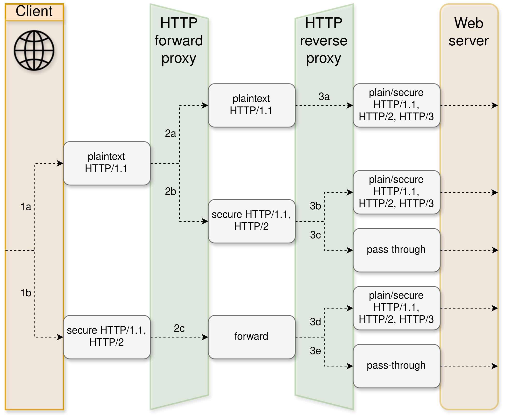

SCION HTTP Reverse Proxy
========================

The SCION HTTP Reverse Proxy makes HTTP(S) resources available via SCION by configuring a reverse proxy in front of them.
It is implemented as a Caddy plugin, and can be used with any compatible Caddy server version.

If you are looking for the forward proxy, see :doc:`Forward Proxy <forward-proxy>`.

Overview
--------

The caddy plugin currently supports two types of network listeners:

- HTTP1.1/HTTP2.0 over SCION: The plugin can listen for incoming HTTP1.1/HTTP2.0 requests over a single-stream SCION connection. 
  
  This enables SCION resources to be accessed by the :doc:`Forward Proxy <forward-proxy>`.
  More concretely, if you intend to make your resources available for the current `SCION Browser Extension <https://scion-browser-extension.readthedocs.io/en/latest/index.html>`_ you can use this mode.

- HTTP3 over SCION: The plugin supports a native HTTP3 listener over SCION to serve resources to clients that support HTTP3. Note that HTTP3 is not supported by the SCION Browser Extension.

Prerequisites
-------------
- A ``SCION-enabled host`` in a ``SCION-enabled network`` (see `Access and Host Configuration <https://docs.scion.org/projects/scion-applications/en/latest/applications/access.html>`_).

Installation
------------

You can install the SCION HTTP Reverse Proxy building it for the target platform or downloading the pre-built binary in `releases <https://github.com/scionproto-contrib/caddy-scion/releases>`_.

Build for Linux
~~~~~~~~~~~~~~~

You can build the caddy server containing the SCION plugin from source as follows:

- Download the source code from the `Caddy SCION repository <https://github.com/scionproto-contrib/caddy-scion>`_.
- Depending on what protocol the reverse proxy should support, you can build the binary with the following commands:
  
  - Native HTTP3 support:

    .. code-block:: bash

        go build -o ./build/scion-caddy-native ./cmd/scion-caddy-native
  

  - HTTP1.1, HTTP2.0 and native HTTP3 over SCION:

    .. code-block:: bash

        go build -o ./build/scion-caddy-reverse ./cmd/scion-caddy-reverse
  

Then, you can follow the steps below to install the plugin:

- Copy the binary to ``/usr/local/bin`` or any other directory in your ``$PATH``.
- Add network capabilities to the binary:

    .. code-block:: bash

        sudo setcap cap_net_bind_service=+ep /usr/local/bin/scion-caddy

- Optionally you can create a systemd service and enable it. You can use the example service file ``scion-caddy.service`` in the `examples <https://github.com/scionproto-contrib/caddy-scion/tree/main/_examples>`__.

- The reverse proxy can work in two modes, `layer-5 <#layer-5-reverse-proxy>`__ or `layer-4 (passthrough) <#layer-4-reverse-proxy-passthrough>`__. 
  Check the corresponding sections to configure the reverse proxy accordingly.
  

Build for Windows
~~~~~~~~~~~~~~~~~

.. note::
  Experimental option. The SCION HTTP reverse proxy has not been tested on Windows yet.

You can build the caddy server containing the SCION plugin from source as follows:

- Download the source code from the `Caddy SCION repository <https://github.com/scionproto-contrib/caddy-scion>`_.
- Depending on what protocol the reverse proxy should support, you can build the binary with the following commands:

  - Native HTTP3 support:

    .. code-block:: bash

        GOOS=windows GOARCH=amd64 go build -o ./build/scion-caddy-native ./cmd/scion-caddy-native
  

  - HTTP1.1, HTTP2.0 and native HTTP3 over SCION:

    .. code-block:: bash

        GOOS=windows GOARCH=amd64 go build -o ./build/scion-caddy-reverse ./cmd/scion-caddy-reverse

Then, you follow the steps below:

- Ensure that you are running the scion-endhost stack as described in the `SCION documentation <https://docs.scion.org/projects/scion-applications/en/latest/applications/access.html>`_.

- The reverse proxy can work in two modes, `layer-5 <#layer-5-reverse-proxy>`__ or `layer-4 (passthrough) <#layer-4-reverse-proxy-passthrough>`__. 
  Check the corresponding sections to configure the reverse proxy accordingly.

- Run the binary with the configuration file:

  .. code-block:: bash

    .\\scion-caddy run -conf \\path\\to\\your\\config.json

.. warning::
  The SCION endhost stack is not officially supported on Windows, but it can be built and run with some limitations.
  Mainly, the dispatcher is not supported on Windows, but you can run SCION applications in environments that do not require the dispatcher.
  This is applicable if your network provider runs SCION version >= 0.12.0, available from the `Releases <https://github.com/scionproto/scion/releases>`_.

Configuration
-------------
The SCION HTTP Reverse Proxy is configured via the Caddy JSON config. The location of the JSON config is specified in the systemd service file or when running the binary via the ``-conf`` flag.
One can enable two modes of operation: layer-5 reverse proxy and layer-4 reverse proxy (passthrough) by configuring the Caddy JSON file accordingly.

ISD-AS environment
~~~~~~~~~~~~~~~~~~
The SCION HTTP Reverse Proxy can be configured to serve resources for different ISD-ASes. Those are configured in ``/etc/scion/environment.json`` file.
You can specify a different location by setting the ``SCION_ENV_PATH`` environment variable. The file format is as follows:

.. code-block:: json

  {
      "ases": {
          "<ISD-AS>": {
              "daemon_address": "<IP>:<Port>"
          },
          "<ISD-AS>": {
              "daemon_address": "<IP>:<Port>"
          }
      }
  }

Layer-5 Reverse Proxy
~~~~~~~~~~~~~~~~~~~~~
The SCION HTTP Reverse Proxy can act as a layer-5 reverse proxy, terminating the TLS connection and forwarding the request to the backend server.
In this case, the reverse proxy must provide the expected certificate for the specified domain. 
Afterwards, it will forward the HTTP request to the backend server.

The plugin configuration for caddy is extended with:

- ``scion module`` <https://caddyserver.com/docs/modules/scion>`_
- SCION network listener configuration, which is used to specify the SCION address and port to listen on, we extend with the following network names:

  - ``scion``: The SCION network listener for native HTTP3 over SCION.
  - ``scion+single-stream``: The SCION network listener for HTTP1.1/HTTP2.0 over SCION.

The address follows the `network address convention <https://caddyserver.com/docs/conventions#network-addresses>`_ for Caddy, e.g., ``scion/[1-ff00:0:112,127.0.0.1]:8443`` or ``scion+single-stream/[1-ff00:0:112,127.0.0.1]:7443``.

One can follow the example in `examples <https://github.com/scionproto-contrib/caddy-scion/tree/main/_examples/reverse.json>`__ to configure the reverse proxy to serve specific domains in this mode.
For more information on how to configure Caddy, see the `Caddy documentation <https://caddyserver.com/docs/json/apps/http/>`_.

Layer-4 Reverse Proxy (Passthrough)
~~~~~~~~~~~~~~~~~~~~~~~~~~~~~~~~~~~
If TLS termination option is not desirable due to the setup, the SCION HTTP Reverse Proxy can act as a layer-4 reverse proxy, forwarding the TCP connection to the backend server.
In this case, the reverse proxy will not terminate the TLS connection, but will forward the TCP connection to the backend server.

This feature is enabled via the non-standard layer-4 module (see `Caddy layer-4 documentation <https://caddyserver.com/docs/json/apps/layer4>`_).

The plugin configuration for caddy is extended with:

- SCION network listener configuration, which is used to specify the SCION address and port to listen on, we extend with the following network names:

  - ``scion+single-stream``: The SCION network listener for single-stream connection over SCION. 

One can follow the example in the `examples <https://github.com/scionproto-contrib/caddy-scion/tree/main/_examples/passthrough_scionlab.json>`__ to configure the reverse proxy to serve specific domains in this mode.
For more information on how to configure Caddy, see the `Caddy layer-4 documentation <https://caddyserver.com/docs/json/apps/layer4>`_.

.. note::
  Layer-4 reverse proxy for HTTP3 clients has not been tested yet. 
  One may try to use the "scion" network listener with the layer-4 module to achieve this, especially in combination with ``layer4.matchers.quic``.
  For more information you can check `Caddy layer-4 github repo <https://github.com/mholt/caddy-l4?tab=readme-ov-file#introduction>`_.

Forward Proxy and Reverse Proxy ecosystem
-----------------------------------------

The SCION HTTP Reverse Proxy can be used in combination with the `SCION Forward Proxy <forward-proxy>` to provide a SCION browsing experience.
The figure below shows the enabled ecosystem.

.. _reverse-proxy-figure:

